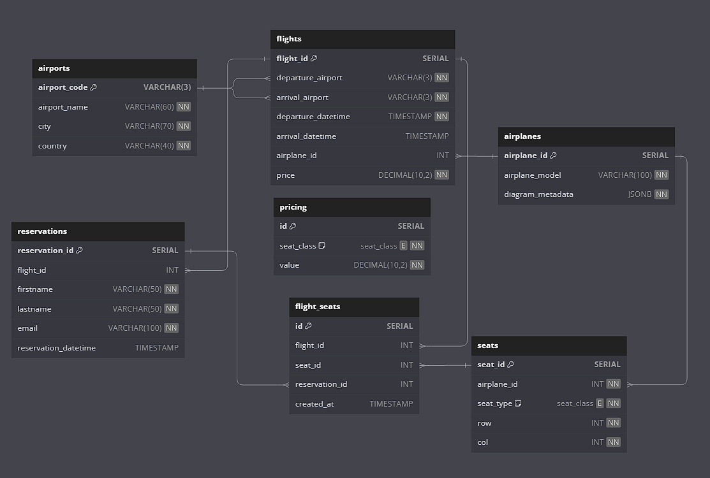

# Databases project - flight reservation
---
### Authors
- Mateusz Wala
- Piotr Andres
---
### Used technologies and why we chose them
- Database: **PostgreSQL**
- Backend: **Go** + **sqlc**
- Frontend: **TypeScript** + **React**

**PostgreSQL** became our database of choice, because we had prior experience with it. Also it is widely used in the industry.

**Go** was chosen as the backend language, because it is a statically typed, which makes it easier to catch errors at compile time. Moreover, it is really simple and fast, which makes it a great choice for backend services.

**sqlc** is a tool that generates type-safe Go code from SQL queries. It simplifies the process of writing database access code and makes it less error-prone by checking for non-existing columns and relations, for example.

**TypeScript**, being a compiled language, enabled us to write more robust code. It also has a lot of features that JavaScript lacks, like static typing, interfaces, enums, and more.

**React** was chosen, because it is widely used in the industry and has a lot of libraries and tools that make development easier and faster. Also, we had prior experience with it. 

---
### Database structure


---

#### Database SQL schema 
```sql
CREATE TYPE "seat_class" AS ENUM (
  'economy',
  'business',
  'first_class',
  'economy_plus'
);

CREATE TABLE "airports" (
  "airport_code" VARCHAR(3) PRIMARY KEY,
  "airport_name" VARCHAR(60) NOT NULL,
  "city" VARCHAR(70) NOT NULL,
  "country" VARCHAR(40) NOT NULL
);

CREATE TABLE "airplanes" (
  "airplane_id" SERIAL PRIMARY KEY,
  "airplane_model" VARCHAR(100) NOT NULL,
  "diagram_metadata" JSONB NOT NULL
);

CREATE TABLE "flights" (
  "flight_id" SERIAL PRIMARY KEY,
  "departure_airport" VARCHAR(3) NOT NULL,
  "arrival_airport" VARCHAR(3) NOT NULL,
  "departure_datetime" TIMESTAMP NOT NULL,
  "arrival_datetime" TIMESTAMP,
  "airplane_id" INT,
  "price" DECIMAL(10,2) NOT NULL
);

CREATE TABLE "reservations" (
  "reservation_id" SERIAL PRIMARY KEY,
  "flight_id" INT,
  "firstname" VARCHAR(50) NOT NULL,
  "lastname" VARCHAR(50) NOT NULL,
  "email" VARCHAR(100) NOT NULL,
  "reservation_datetime" TIMESTAMP
);

CREATE TABLE "flight_seats" (
  "id" SERIAL PRIMARY KEY,
  "flight_id" INT,
  "seat_id" INT,
  "reservation_id" INT,
  "created_at" TIMESTAMP
);

CREATE TABLE "seats" (
  "seat_id" SERIAL PRIMARY KEY,
  "airplane_id" INT NOT NULL,
  "seat_type" seat_class NOT NULL,
  "row" INT NOT NULL,
  "col" INT NOT NULL
);

CREATE TABLE "pricing" (
  "id" SERIAL PRIMARY KEY,
  "seat_class" seat_class NOT NULL,
  "value" DECIMAL(10,2) NOT NULL
);

ALTER TABLE "flight_seats" ADD FOREIGN KEY ("reservation_id") REFERENCES "reservations" ("reservation_id");

ALTER TABLE "flights" ADD FOREIGN KEY ("arrival_airport") REFERENCES "airports" ("airport_code");

ALTER TABLE "flights" ADD FOREIGN KEY ("departure_airport") REFERENCES "airports" ("airport_code");

ALTER TABLE "flight_seats" ADD FOREIGN KEY ("flight_id") REFERENCES "flights" ("flight_id");

ALTER TABLE "flight_seats" ADD FOREIGN KEY ("seat_id") REFERENCES "seats" ("seat_id");

ALTER TABLE "seats" ADD FOREIGN KEY ("airplane_id") REFERENCES "airplanes" ("airplane_id");

ALTER TABLE "reservations" ADD FOREIGN KEY ("flight_id") REFERENCES "flights" ("flight_id");

ALTER TABLE "flights" ADD FOREIGN KEY ("airplane_id") REFERENCES "airplanes" ("airplane_id");
```

### Sample CRUD operations
SQL queries for CRUD operations:
```sql
-- name: AddFlight :exec
INSERT INTO flights (departure_airport, arrival_airport, departure_datetime, arrival_datetime, airplane_id, price)
VALUES (@departure_airport, @arrival_airport, @departure_datetime, @arrival_datetime, @airplane_id::int, @price);

-- name: GetFlightById :one
SELECT f.*
FROM flights AS f
WHERE f.flight_id = @flight_id;

-- name: DeleteFlight :exec
DELETE FROM flights
WHERE flight_id = @flight_id;

-- name: UpdateFlight :exec
UPDATE flights
SET departure_datetime = @departure_datetime, arrival_datetime = @arrival_datetime, price = @price
WHERE flight_id = @flight_id;
```

### Transactional operations
SQL queries for smaller parts of transactional operations:
```sql
-- name: AddReservation :one
INSERT INTO reservations (flight_id, firstname, lastname, email, reservation_datetime)
VALUES (@flight_id::int, @firstname, @lastname, @email, NOW())
RETURNING *;

-- name: DeleteReservation :exec
DELETE FROM reservations WHERE reservation_id = @reservation_id::int;

-- name: AddReservationSeats :copyfrom
INSERT INTO flight_seats (flight_id, reservation_id, seat_id)
VALUES (@flight_id::int, @reservation_id::int, @seat_id::int);

-- name: DeleteReservationSeats :exec
DELETE FROM flight_seats
WHERE reservation_id = @reservation_id::int
AND seat_id = ANY(sqlc.slice('seat_ids')::int[]);

-- name: DeleteAllReservationSeats :many
DELETE FROM flight_seats
WHERE reservation_id = @reservation_id::int
RETURNING seat_id::int;
```

Here is the part of the code that is responsible for creating a new reservation. Whole code can be found in the `backend/cmp/api/reservations.handler.go` file: 
```go
tx, err := app.db.BeginTx(r.Context(), pgx.TxOptions{})
if err != nil {
  app.serverError(w, r, err)
  return
}
defer tx.Rollback(r.Context())

flight, err := app.db.GetFlightById(r.Context(), tx, input.FlightID)
if err != nil && err != pgx.ErrNoRows {
  app.serverError(w, r, err)
  return
}

(...)

if flight.DepartureDatetime.Time.Before(time.Now()) {
  msg := map[string]string{"message": "Flight has already departed"}
  response.JSON(w, http.StatusConflict, msg)
  return
}

allSeats, err := app.db.GetSeatIDs(r.Context(), tx, db.GetSeatIDsParams{Rows: rows, Cols: cols, AirplaneID: flight.AirplaneID.Int32})
if err != nil && err != pgx.ErrNoRows {
  app.serverError(w, r, err)
  return
}

(...)

if len(seatIDs) != len(input.Seats) {
  msg := map[string]string{"message": "Some seats do not exist"}
  response.JSON(w, http.StatusNotFound, msg)
  return
}

unavailableIDs, err := app.db.CheckIfUnavailable(r.Context(), tx, db.CheckIfUnavailableParams{SeatIds: seatIDs, FlightID: input.FlightID})
if err != nil {
  app.serverError(w, r, err)
  return
}

unavailableSeats := misc.FindUnavailable(unavailableIDs, allSeats)
if len(unavailableSeats) > 0 {
    data := map[string]interface{}{
      "message": "Some seats are unavailable",
      "seats":   unavailableSeats,
  }
  if err = response.JSON(w, http.StatusConflict, data); err != nil {
    app.serverError(w, r, err)
  }
  return
}

(...)

reservation, err := app.db.AddReservation(r.Context(), tx, params)
if err != nil {
  app.serverError(w, r, err)
  return
}

(...)

_, err = app.db.AddReservationSeats(r.Context(), tx, seatsParams)
if err != nil {
  app.serverError(w, r, err)
  return
}

if err = tx.Commit(r.Context()); err != nil {
  app.serverError(w, r, err)
  return
}
```


### Reporting operations
When creating reports, we depend on read-only transactions. Code can be found in the `backend/cmp/api/reports.handler.go` file.

SQL queries for reports:
```sql
-- name: GetPopularFlights :many
SELECT f.departure_airport, f.arrival_airport, COUNT(s.seat_id) as seat_count
FROM flights f
JOIN flight_seats s ON f.flight_id = s.flight_id AND departure_datetime BETWEEN @start_date::date AND @end_date::date
GROUP BY f.departure_airport, f.arrival_airport
ORDER BY seat_count DESC
LIMIT @custom_limit::int;

-- name: GetPopularDestinations :many
SELECT f.arrival_airport, COUNT(s.seat_id) as seat_count
FROM flights f
JOIN flight_seats s ON f.flight_id = s.flight_id AND departure_datetime BETWEEN @start_date::date AND @end_date::date
GROUP BY f.arrival_airport
ORDER BY seat_count DESC
LIMIT @custom_limit::int;

-- name: GetTicketsSoldBetweenDates :one
SELECT COUNT(seat_id) as seat_count
FROM flight_seats
WHERE created_at BETWEEN @start_date::date AND @end_date::date;

-- name: GetTotalEarningsBetweenDates :many
SELECT s.seat_type, 
       SUM(f.price * p.value)::numeric AS value
FROM seats s 
INNER JOIN flight_seats fs ON s.seat_id = fs.seat_id 
INNER JOIN flights f ON fs.flight_id = f.flight_id 
INNER JOIN pricing p ON s.seat_type = p.seat_class
WHERE fs.created_at BETWEEN @start_date::date AND @end_date::date
GROUP BY s.seat_type;

-- name: GetPeriodicEarningsBetweenDates :many
SELECT 
        GREATEST(DATE_TRUNC(@type, created_at), @start_date)::date AS period_start,
        SUM(f.price * p.value)::numeric AS earnings
FROM seats s 
INNER JOIN flight_seats fs ON s.seat_id = fs.seat_id
INNER JOIN flights f ON fs.flight_id = f.flight_id 
INNER JOIN pricing p ON s.seat_type = p.seat_class
WHERE created_at BETWEEN @start_date AND @end_date::date
GROUP BY period_start
ORDER BY period_start ASC;
```

---
### API structure
The API structure is explained in detail in the backend folder.

---
### Frontend Overview
The frontend structure is explained in detail in the frontend folder. 
