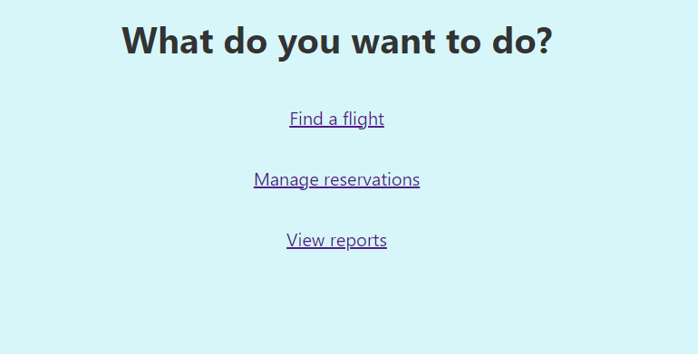
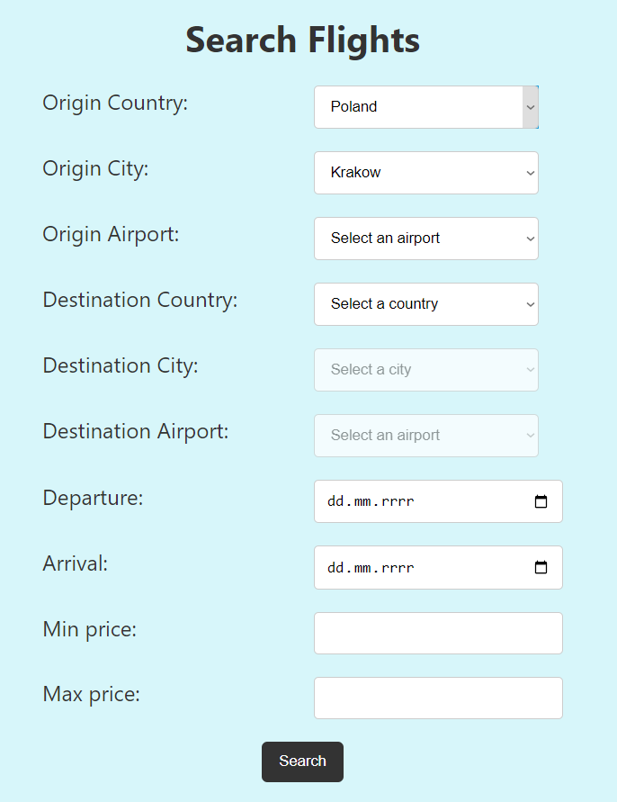
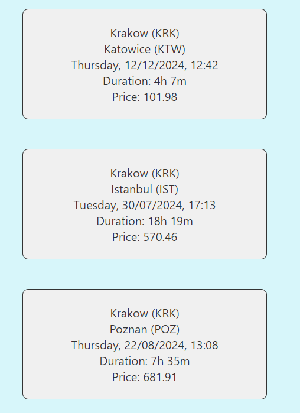
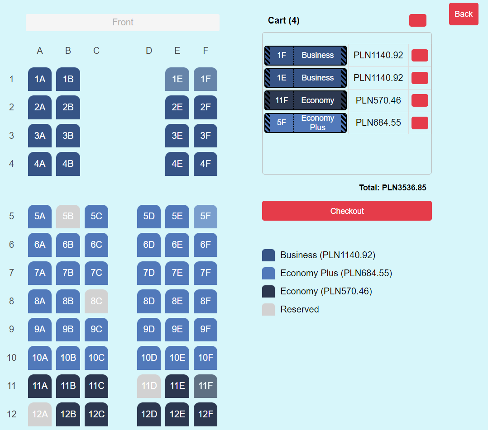
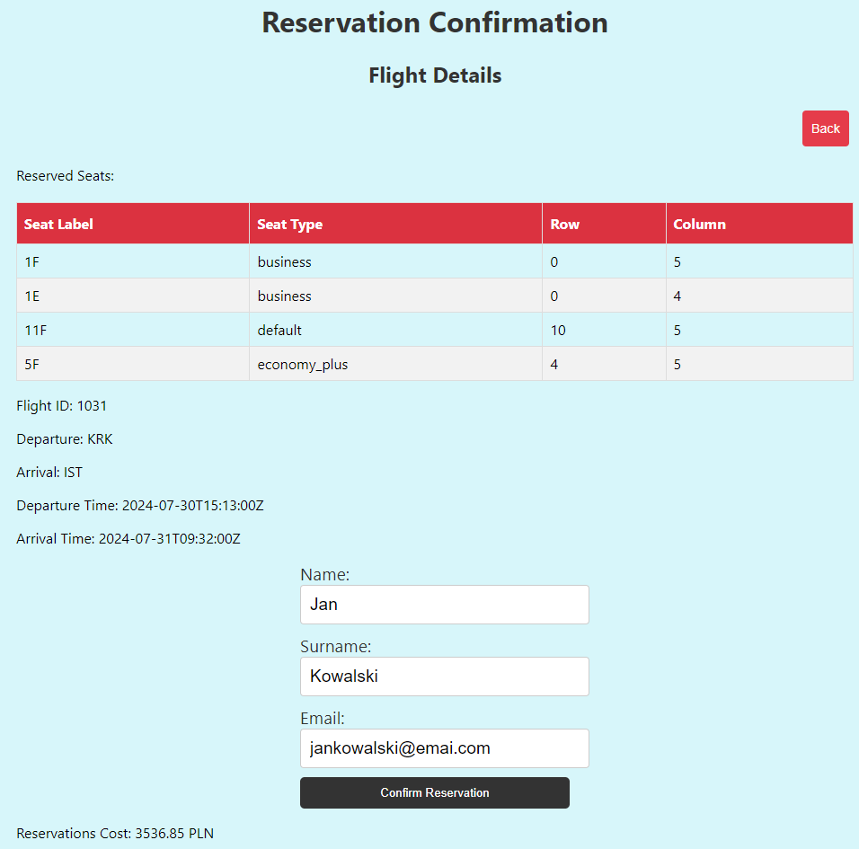
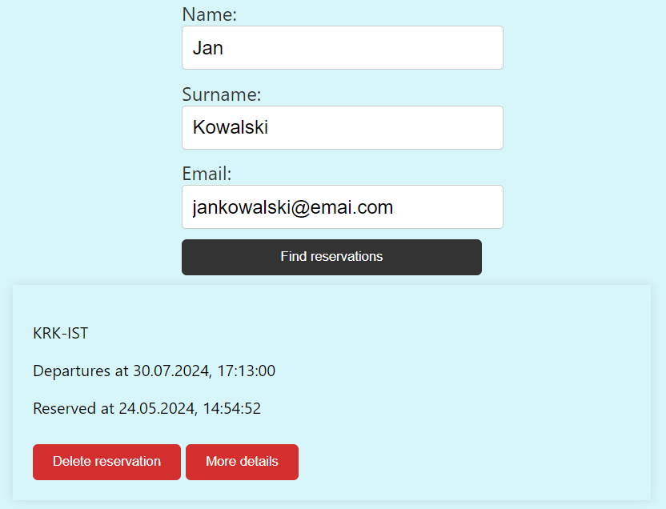
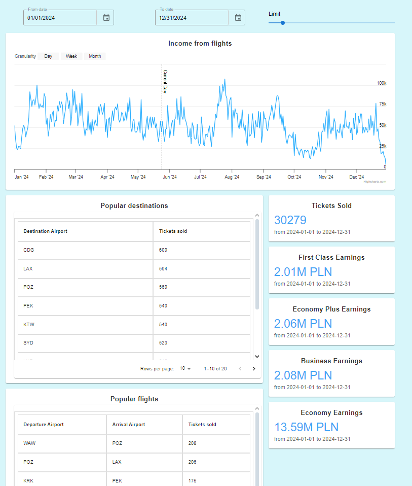

# Frontend

This project was bootstrapped with [Create React App](https://github.com/facebook/create-react-app).

---

### Prerequisites

- Node.js (version 14.x or later)
- npm (Node Package Manager, usually installed with Node.js)

---

### Install dependencies:

Inside the project directory, run the following command to install all dependencies:

```
npm install
```

This will install all the necessary packages listed in the package.json file.

---

### (Optional) Fix dependency issues:
If there are dependency issues after installing, you can try fixing them:
```
npm audit fix --force
```

---

### Running the Frontend
Once you've installed the dependencies, you can run the frontend:
```
npm start
```

---

### Frontend Overview

- #### Home Page
    Main page where users can choose their next actions.
    

- #### Flight Search
    Page with simple inputs for specifying flight criteria.
    

- #### Sample Searched Flights
    

- #### Flight Specification
    After selecting a flight, users are presented with a seating arrangement and a cart for selecting seats.
    

- #### Flight Details
    Page displaying basic information about the selected flight and seats. Users can confirm their reservation after providing necessary details.
    

- #### Manage Reservation Page
    Allows users to search and manage their reservations.
    
    
- #### Reports Page
    Provides statistics on flight income and popular destinations.
    
